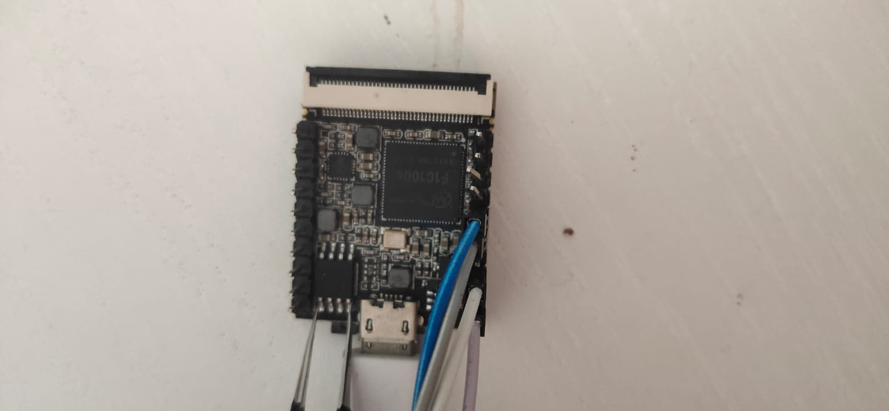

# Business Card Linux With Computer Vision

This is the Linux distribution small enough to run OpenCV from the 16MB of storage on the Linux-powered business card.
It is powered by the Allwinner F1C100s, a $1.40 Linux-capable ARM system-on-chip.
This repository is the source code for its firmware image, based on Buildroot 2019.05 and [thirtythreeforty/businesscard-linux][thirtythreeforty/businesscard-linux].
This directory is a "Buildroot external," providing a few patches, additional packages, board support, computer vision packages(OpenCV3, Numpy1.8), Syncdrive package and files on top of mainline Buildroot.

## Build

Make sure submodules are initialized:

	git submodule update --init

Change to the top-level Buildroot directory:

	cd buildroot

Initialize the configuration, including the defconfig and this external directory:

	make BR2_EXTERNAL=$PWD/../ kbuyukburc_businesscard_defconfig

And compile:

	make

This may take a couple hours to do from scratch, depending on the speed of your machine.

## What you can do
In this case, the card emulates a very small flash drive. the flash drive include my resume, readme and lenna photos(famous computer vision person).  

This small flash drive can mount on linux filesystem or usb mass storage device.
With mounting linux filesystem, You can use opencv libraries with python on 
mounted filesystem.  
For example,  
can read lenna.png(cv2.imread),  
change color space to
grayscale(cv2.cvtColor)  
and save as jpeg file(cv2.imwrite).

```
    syncdrive mount
    python
    >>import cv2
    >>import numpy as np
    >>img = cv2.imread('/mnt/lenna.png')
    >>img_gray = cv2.cvtColor(img, cv2.COLOR_BGR2GRAY)
    >>cv2.imwrite('/mnt/lenna_gray.jpg', img_gray)
    >>exit()
    syncdrive usb
```

- You can easly calibrate your cameras with adding checker board images to the
usb mass storage.
- You can make panorama image with opencv Stitcher module.
- You can undistord your fisheye images.
- Rest is your imagination.

## Installation

If you have a [Lichee Pi Nano][lichee-nano] with a flash chip, you can flash it with the following command.
Make sure the board is in FEL mode using `dmesg` or similar.

	output/host/bin/sunxi-fel -p spiflash-write 0 output/images/flash.bin

With shorting your SPI flash memory chip pin 1 and pin 4 on boot using tweezer, you can force your f1c100s chip to run flashing mode(FEL mode) with sunxi-fel tool. 



You can erase the card after it boots by simply logging in (as `root`) and erasing the flash manually:

	dd if=/dev/zero of=/dev/mtd0

Don't erase it unless you're prepared to burn a new image!

## SYNCDRIVE

To use OpenCV on files, I create MTD partition to mount on filesytem(at /mnt) as well as you can mount this partition to usb massstorage device. Thus, you can access this mass storage from your host PC and transfer your images to this partition and apply image processing on those images or camera calibrations with mounting partition to linux filesystem

```
syncdrive usb
```
Mount partition to USB Stoarage

```
syncdrive mount
```
Mout partition to local filesystem at '/mnt'

## My Business Card Board
I haven't finalize my hardware design. But since i live in
Singapore, I believe i can easly beat $3 price which calculated by thirtythreeforty on [businesscard-linux][thirtythreeforty/businesscard-linux] repo. Furthermore I
 want to add image sensor(OV2640). 

## License

Subject to the below exceptions, code is released under the GNU General Public License, version 2 or (at your option) any later version.
See also the [Buildroot license notice][buildroot-license] for more nuances about the meaning of this license.

Patches are not covered by this license. Instead, they are covered by the license of the software to which the patches are applied.

Files in the `businesscard-syncdrive` package, including its README, my resume remain proprietary and are not released under the GPL.
If you would like to build your own firmware based on this, simply remove those files, or deselect the package during build.

[linux-f1c100s]: https://github.com/kbuyukburc/linux.git
[uboot-f1c100s]: https://github.com/kbuyukburc/u-boot.git
[buildroot]: https://github.com/kbuyukburc/buildroot
[thirtythreeforty/businesscard-linux]: https://github.com/thirtythreeforty/businesscard-linux.git
[lichee-nano]: https://www.seeedstudio.com/Sipeed-Lichee-Nano-Linux-Development-Board-16M-Flash-WiFi-Version-p-2893.html
[buildroot-license]: https://buildroot.org/downloads/manual/manual.html#legal-info-buildroot

